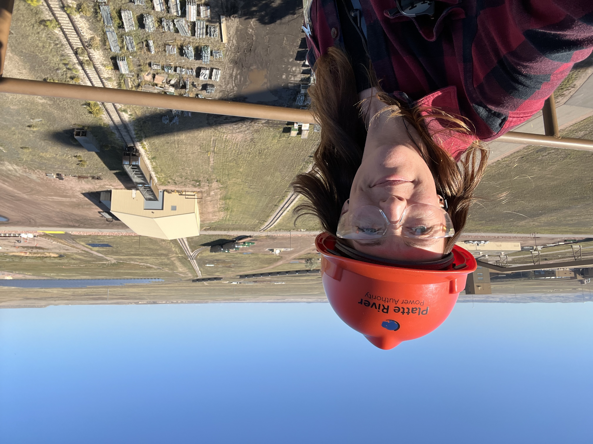

```{=html}
<div style="max-width: 960px; margin: 1rem auto; padding: 0 1.5rem;">

  <style>
    .masonry {
      columns: 3;
      column-gap: 1rem;
    }
    .masonry-item {
      break-inside: avoid;
      margin-bottom: 1rem;
    }
    .masonry-item img {
      width: 100%;
      display: block;
      border-radius: 8px;
    }
    @media (max-width: 768px) {
      .masonry { columns: 2; }
    }
    @media (max-width: 480px) {
      .masonry { columns: 1; }
    }
  </style>

  <div class="masonry">

    <div class="masonry-item">
      
    </div>
    
    <div class="masonry-item">
      
    </div>

    <div class="masonry-item">
      
    </div>

    <div class="masonry-item">
      
    </div>
    
    <div class="masonry-item">
      
    </div>

    <div class="masonry-item">
      
    </div>

    <!-- Add more photos by copying a masonry-item block -->

  </div>

</div>
```
