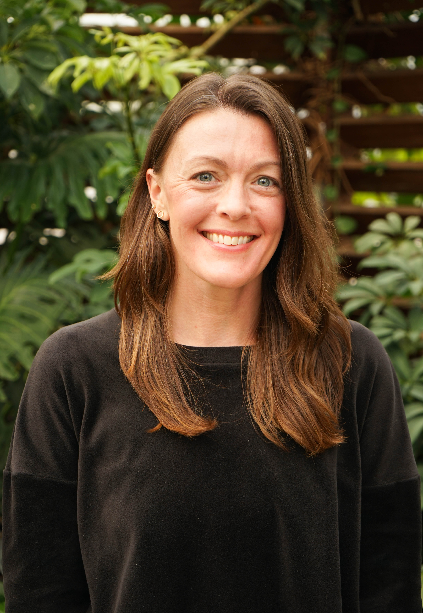

```{=html}
<div style="max-width: 720px; margin: 3rem auto 2rem; display: flex; align-items: center; gap: 2.5rem;">
  
  <div>
    <div style="font-size: 2.5rem; font-weight: 700; color: #1e2d2a; letter-spacing: -0.03em; margin-bottom: 0.3rem;">Lynette Schwanger</div>
    <div style="font-size: 1.05rem; color: #6b8f85; margin-bottom: 1rem; ">Environmental Scientist<br>Water Resources · Carbon Management</div>
    <div style="width: 48px; height: 3px; background: #2e7d6e; border-radius: 2px;"></div>
  </div>
</div>
```

::: about-section
## About

I am a graduate student in Ecosystem Science and Sustainability at Colorado State University, focused on water resources and carbon management. My work centers on translating complex environmental data into actionable solutions, whether that's building geospatial water supply databases for a National Park Service climate adaptation project, developing remote sensing models to assess wetland carbon recovery, or teaching environmental data science to the next cohort of students at CSU.

I came to this field through an unconventional path. After over a decade building and leading a video production company, a long-term partnership with a client in the tech industry began shifting my focus. Watching growing energy demands accelerate environmental pressures made me want to be on the other side of that problem. But it was a moment on Twin Lakes as I was ferrying firefighters across the water toward the smoke of the Interlaken Fire, watching the flames threaten a reservoir my community depended on, that made my path clear. I've centered my graduate work on data-informed approaches to climate resilience and water resource protection, bringing my skills in stakeholder engagement, strategic thinking, and clear communication to the problems that matter most to me and my home community in Leadville, Colorado.
:::
